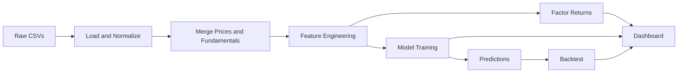

# FactorLens Technical Documentation

## 1. Problem and Goal

**Problem:** Traditional factor investing often relies on fixed, theory-driven signals that do not adapt well to changes in market regimes or data coverage. Researchers need a workflow that learns factor behavior directly from data, quantifies signal efficacy, and explains model-driven predictions in a portfolio context.

**Goal:** FactorLens builds a reproducible pipeline that ingests price and fundamentals data, engineers factor characteristics, learns prediction models, constructs long-short factor returns, and surfaces results in a clean dashboard. The system is designed to be transparent, explainable, and easy to extend.

## 2. Solution Overview

FactorLens is a linear, pipeline-first workflow with a Streamlit UI on top of persisted, structured outputs:

1. Ingest raw prices and fundamentals CSVs.
2. Normalize columns and compute returns.
3. Merge fundamentals to prices using time-aligned as-of joins.
4. Engineer factor characteristics and forward returns.
5. Build long-short factor returns for each signal.
6. Train models to predict forward returns and compute feature importance.
7. Backtest predictions as a long-short strategy.
8. Compute portfolio factor exposure.
9. Visualize all artifacts in the dashboard.

## 3. High-Level Architecture



Why this architecture:

- **Pipeline-first** keeps research steps modular and reproducible.
- **As-of merge** reflects realistic fundamental availability at each price date.
- **Long-short returns** isolate factor performance from market direction.
- **Streamlit UI** makes results accessible to both technical and non-technical users.

## 4. Project Structure (Complete)

```
app.py
Readme.md
requirements.txt
data/
    raw/
        prices/
        fundamentals/
    processed/
src/
    config.py
    data_pipeline/
        load_data.py
        preprocess.py
    feature_engineering/
        factor_features.py
    factor_engine/
        factor_portfolio.py
        exposure_analysis.py
    models/
        train.py
        lasso_model.py
        random_forest.py
        xgboost_model.py
    utils/
        columns.py
        io.py
    visualization/
        dashboard.py
notebooks/
    FactorLens_Build.ipynb
```

## 5. Configuration and Paths

`src/config.py` defines all core locations:

- `DATA_RAW` and `DATA_PROCESSED` for input/output data.
- `PRICES_DIR` and `FUNDAMENTALS_DIR` for raw sources.
- `PROCESSED_FEATURES` and `PROCESSED_FACTORS` for demo-mode artifacts.

**Why:** Centralizing path configuration prevents hard-coded directories and allows the app and pipeline to share the same constants.

## 6. Data Inputs and Schema Normalization

### 6.1 Price Data Expectations

Required columns after normalization:

- `date` (trading date)
- `ticker` (symbol)
- `close` (closing price)

Optional columns used if present:

- `open`, `volume`

### 6.2 Fundamentals Data Expectations

Required columns after normalization:

- `date` (fiscal/report date)
- `ticker`

Optional columns used in feature engineering:

- `market_cap`, `book_value`, `pe_ratio`, `pb_ratio`, `revenue`, `net_income`,
    `total_assets`, `shares_outstanding`

### 6.3 Column Normalization

`src/data_pipeline/load_data.py` defines candidate column names and standardizes inputs:

- `PRICE_COLUMN_CANDIDATES` maps variations like `adj_close` to `close`.
- `FUND_COLUMN_CANDIDATES` maps variations like `marketcapitalization` to `market_cap`.

Normalization is applied by:

1. Lowercasing and replacing spaces/hyphens with underscores.
2. Matching known candidates to canonical names.

**Why:** Real-world CSVs rarely use the same schema. The mapping layer makes ingestion robust without forcing strict source formatting.

### 6.4 File Reading and Discovery

`src/utils/io.py` lists CSV files recursively under the raw folders. Price files may be read from `data/raw/prices/stocks` if present, otherwise from `data/raw/prices`.

If a price file lacks a ticker column, the filename stem becomes the ticker.

If a fundamentals file lacks a date column, the year is inferred from the filename (e.g., `2018_Financial_Data.csv` -> `2018-12-31`).

**Why:** Kaggle datasets and CSV exports often embed metadata in file names instead of columns.

## 7. Data Preprocessing

`src/data_pipeline/preprocess.py` performs two core steps:

1. **Return computation:**
     - `return = close.pct_change()` computed per ticker.
2. **As-of merge:**
     - `pd.merge_asof` joins fundamentals to prices by date, per ticker, using the latest available report prior to each price date.

**Why:**

- Daily returns are the base for momentum, volatility, and target labels.
- As-of joins prevent look-ahead bias by using only information known at or before each price date.

## 8. Feature Engineering (All Signals)

`src/feature_engineering/factor_features.py` defines the full factor set and builds features for each ticker. It also computes the target variable.

### 8.1 Feature List

Default signals:

- `momentum_12m`
- `momentum_6m`
- `momentum_3m`
- `volatility_3m`
- `volatility_1m`
- `size`
- `value`
- `profitability`
- `growth`
- `quality`
- `earnings_yield`
- `leverage`
- `liquidity`

### 8.2 Feature Formulas

All calculations are done per ticker in date order:

- **Momentum:**
    - `momentum_12m = pct_change(close, 252)`
    - `momentum_6m = pct_change(close, 126)`
    - `momentum_3m = pct_change(close, 63)`

- **Volatility:**
    - `volatility_3m = rolling_std(return, 63)`
    - `volatility_1m = rolling_std(return, 21)`

- **Size:**
    - `market_cap = close * shares_outstanding` if `market_cap` missing.
    - `size = log(market_cap)`

- **Value:**
    - `value = book_value / market_cap`

- **Profitability:**
    - `profitability = net_income / total_assets`

- **Quality:**
    - `quality = net_income / revenue` (only if revenue exists)

- **Growth:**
    - `growth = pct_change(revenue, 4)` (year-over-year on quarterly cadence)

- **Earnings yield:**
    - `earnings_yield = 1 / pe_ratio` (if `pe_ratio` available)

- **Leverage:**
    - `leverage = total_assets / market_cap`

- **Liquidity:**
    - `liquidity = log1p(rolling_mean(volume, 21))`

### 8.3 Target Variable

- `return_next = return.shift(-1)` per ticker.

This produces a one-step-ahead forward return label used for supervised learning.

### 8.4 Feature Availability

Features are only kept if a column exists and has any non-null values. Rows without all available features or `return_next` are removed.

**Why:**

- Keeps the training set consistent.
- Avoids leakage from forward-looking data.
- Prevents model instability from sparse or missing features.

## 9. Factor Construction (Long-Short Factor Returns)

`src/factor_engine/factor_portfolio.py` converts each feature into a factor return series.

Method:

1. For each date, sort stocks by the feature value.
2. Split into quantiles (default `n_quantiles=5`).
3. Long = top quantile average `return_next`.
4. Short = bottom quantile average `return_next`.
5. Factor return = `long - short`.

**Why:**

- Cross-sectional long-short returns isolate signal strength from market direction.
- Quantiles reduce sensitivity to outliers and provide stable comparisons.

## 10. Machine Learning Models and Training

Model training is centralized in `src/models/train.py` via `train_models()`.

### 10.1 Training Procedure

- Inputs: `feature_cols`, `target_col` (default `return_next`).
- Time-ordered split: 80% train, 20% test (`shuffle=False`).
- StandardScaler is applied to features for linear models.

**Why:**

- Time order avoids forward-looking bias.
- Scaling is required for LASSO to converge and compare coefficients fairly.

### 10.2 Model Choices

**LASSO (default):**

- Implemented with `LassoCV(cv=5, max_iter=10000)`.
- Produces sparse coefficients for interpretability.

**Random Forest:**

- `n_estimators=400`, `max_depth=8`, `min_samples_leaf=3`, `min_samples_split=6`, `max_features='sqrt'`.
- Captures non-linear interactions and feature thresholds.

**XGBoost:**

- `n_estimators=500`, `max_depth=5`, `learning_rate=0.05`, `subsample=0.85`, `colsample_bytree=0.85`, `reg_alpha=0.1`, `reg_lambda=1.0`.
- Provides strong predictive performance with controlled regularization.

### 10.3 Outputs

- **Report:** `mse`, `r2`, and `test_samples`.
- **Predictions:** `pred` column appended to the test slice.
- **Importance:** coefficients (LASSO) or feature importances (tree models).

## 11. Backtesting Strategy (Prediction-Based)

`long_short_by_prediction()` in `src/factor_engine/factor_portfolio.py` uses model predictions:

1. For each date, sort by `pred`.
2. Long = top quantile of predicted returns.
3. Short = bottom quantile.
4. `long_short = mean(long) - mean(short)`.
5. `cumulative = (1 + long_short).cumprod() - 1`.

**Why:**

- Aligns model evaluation with a tradable, market-neutral structure.
- Cumulative return curve provides an intuitive performance summary.

## 12. Portfolio Exposure Analysis

`src/factor_engine/exposure_analysis.py` computes factor exposure for a user-defined portfolio.

Steps:

1. Take latest available feature row per ticker.
2. Multiply each feature by the user weight.
3. Sum across tickers to get exposure per feature.

**Why:**

- Shows which factor tilts dominate a portfolio.
- Connects factor research to portfolio construction decisions.

## 13. Regime Monitoring

The UI includes a market regime proxy:

- Daily market return = cross-sectional mean of ticker returns.
- Rolling 63-day mean and volatility are computed.
- Regimes labeled using median thresholds:
    - **risk-on:** high mean, low volatility
    - **risk-off:** low mean, high volatility
    - **mixed:** all other combinations

**Why:**

- Adds macro context to factor performance.
- Uses a simple, transparent rule set.

## 14. Visualization Layer

`src/visualization/dashboard.py` provides Plotly charts:

- Cumulative factor returns (line chart).
- Feature importance (bar chart).
- Factor correlation heatmap.
- Model comparison chart for MSE and R2.

The Streamlit app (`app.py`) renders:

- Overview tables and regime monitor.
- Factor returns and correlation.
- Model reports, comparisons, and feature importance.
- Backtest curve and long-short return series.
- Portfolio exposure table.

## 15. Data Products and Outputs

Processed outputs stored in `data/processed`:

- `stock_features.csv` (features and targets).
- `factor_returns.csv` (factor return time series).

**Why:**

- Enables quick demo runs without reprocessing raw data.
- Supports deployment environments with restricted storage.

## 16. Tech Stack and Rationale

- **Python 3.10:** Strong data ecosystem, stable, fast iteration.
- **pandas / numpy:** Core tabular data processing.
- **scikit-learn:** Standard ML workflow for LASSO and Random Forest.
- **xgboost:** Gradient boosting for non-linear predictive modeling.
- **Plotly:** Interactive charts for time series and correlations.
- **Streamlit:** Fast, clean dashboarding with minimal frontend overhead.
- **kaggle:** Optional dataset download tooling.

## 17. Key Design Choices (and Why)

- **As-of merge for fundamentals:** avoids look-ahead bias.
- **Long-short quantile construction:** market-neutral signal evaluation.
- **Time-ordered train/test split:** preserves temporal integrity.
- **Multiple model types:** balances interpretability (LASSO) with non-linear capture (RF/XGBoost).
- **Processed CSV demo mode:** reduces setup friction for evaluators.

## 18. Financial Terminology Glossary

- **Factor:** A systematic characteristic that explains cross-sectional returns (e.g., value, momentum).
- **Momentum:** The tendency of assets with strong past performance to continue performing.
- **Volatility:** The standard deviation of returns, a measure of variability or risk.
- **Market cap:** Price times shares outstanding, a proxy for firm size.
- **Value (book-to-market):** Book value divided by market cap; higher implies cheaper valuation.
- **Profitability:** Net income scaled by total assets, a measure of efficiency.
- **Quality:** Net income divided by revenue, a margin-style efficiency proxy.
- **Growth:** Year-over-year revenue change, a proxy for expansion.
- **Earnings yield:** Inverse of P/E ratio, higher implies cheaper earnings.
- **Leverage:** Total assets relative to market cap, a proxy for balance-sheet risk.
- **Liquidity:** Average trading volume (log-scaled), proxy for tradability.
- **Long-short:** Portfolio long high-signal assets and short low-signal assets to isolate factor returns.
- **Factor return:** Performance of the long-short portfolio for a given factor.
- **Backtest:** Simulation of a strategy using historical data.
- **R2:** Coefficient of determination, goodness-of-fit of a model.
- **MSE:** Mean squared error, average squared prediction error.
- **Sharpe proxy:** Mean return divided by standard deviation, annualized in app.

## 19. Limitations and Assumptions

- No transaction costs or slippage modeled.
- No walk-forward cross-validation.
- Fundamentals assumed available at report date; no delay modeling.
- Data quality depends on source CSV accuracy.

## 20. Extension Points

- Add new factors in `src/feature_engineering/factor_features.py`.
- Add new models in `src/models` and wire into `train.py` and `app.py`.
- Add new diagnostics in `src/visualization/dashboard.py`.
- Add new portfolio analytics in `src/factor_engine`.

## 21. How to Run

### Install

```bash
pip install -r requirements.txt
```

### Run App

```bash
streamlit run app.py
```

### Data Modes

- **Processed CSV only:** Uses `data/processed` for quick demo.
- **Kaggle CSVs:** Uses raw data in `data/raw/prices` and `data/raw/fundamentals` to rebuild features and factor returns.

## 22. Module Reference (Complete)

- `app.py`: UI, orchestration, and output rendering.
- `src/config.py`: Centralized path definitions.
- `src/data_pipeline/load_data.py`: CSV discovery, normalization, schema alignment.
- `src/data_pipeline/preprocess.py`: Return calculation and as-of merges.
- `src/feature_engineering/factor_features.py`: Feature construction and target creation.
- `src/factor_engine/factor_portfolio.py`: Factor return construction and prediction-based backtest.
- `src/factor_engine/exposure_analysis.py`: Portfolio exposure calculation.
- `src/models/train.py`: Model training orchestration and metrics.
- `src/models/lasso_model.py`: LASSO model helper.
- `src/models/random_forest.py`: Random Forest helper.
- `src/models/xgboost_model.py`: XGBoost helper.
- `src/utils/columns.py`: Column normalization and mapping.
- `src/utils/io.py`: CSV listing and reading.
- `src/visualization/dashboard.py`: Plotly charts.
- `notebooks/FactorLens_Build.ipynb`: End-to-end notebook workflow.

## 23. SDE Interview Technical Breakdown (Code-Verified)

This section is a code-verified, interview-style analysis of the repository based on the actual implementation in:

- `app.py`
- `src/config.py`
- `src/data_pipeline/load_data.py`
- `src/data_pipeline/preprocess.py`
- `src/feature_engineering/factor_features.py`
- `src/factor_engine/factor_portfolio.py`
- `src/factor_engine/exposure_analysis.py`
- `src/models/train.py`
- `src/models/lasso_model.py`
- `src/models/random_forest.py`
- `src/models/xgboost_model.py`
- `src/utils/columns.py`
- `src/utils/io.py`
- `src/visualization/dashboard.py`
- `requirements.txt`
- `Readme.md`
- `notebooks/FactorLens_Build.ipynb`

### 23.1 High-Level Overview

- **Problem solved:** Learn equity factor signals directly from price and fundamentals data, quantify factor returns, and explain portfolio exposure with model-backed predictions.
- **Target users:** Data-savvy researchers and analysts who want a reproducible factor research workflow with a UI.
- **Core functionality:** CSV ingestion and normalization, as-of merges, feature engineering, long-short factor returns, model training with feature importance, backtest, and Streamlit dashboard rendering.

### 23.2 Architecture

- **Style:** Single-process, pipeline-first, layered Python app with a Streamlit UI. There is no service decomposition or networked components.
- **Folders and responsibilities:**
    - `src/data_pipeline/*` handles ingestion, column normalization, return computation, and as-of merges.
    - `src/feature_engineering/*` defines factor features and target label creation.
    - `src/factor_engine/*` builds factor returns and portfolio exposure analytics.
    - `src/models/*` trains ML models and computes metrics/importance.
    - `src/visualization/*` builds Plotly figures.
    - `app.py` orchestrates the pipeline, training, backtest, and UI.
- **Module interaction flow:** `app.py` calls load/merge functions, feature builder, factor return computation, model training, and Plotly charts; outputs are saved to CSV for demo runs.

### 23.3 Technology Stack

- **Language:** Python 3.10 (declared in `Readme.md` front matter; used by all modules).
- **Framework/UI:** Streamlit for dashboard and user input (`app.py`).
- **Core libraries:** pandas, numpy for data manipulation; scikit-learn for LASSO and Random Forest; xgboost for gradient boosting; plotly for charts.
- **Dependencies:** pinned versions in `requirements.txt`.
- **Package management:** `pip` with `requirements.txt`.

### 23.4 Core Components and Responsibilities

#### UI and Orchestration

- **`app.py`**
    - UI layout, sidebar controls, and CSS styling.
    - Pipeline execution with two modes: raw Kaggle CSVs or processed CSVs.
    - Model training with `train_models()` and backtest via `long_short_by_prediction()`.
    - Portfolio exposure via `portfolio_exposure()` and basic regime labeling.

#### Configuration

- **`src/config.py`**
    - Centralizes project paths for raw and processed data outputs.

#### Data Pipeline

- **`src/data_pipeline/load_data.py`**
    - Normalizes column names (`normalize_columns`, `build_column_map`).
    - Reads price files, infers ticker from filename if needed, and enforces required columns.
    - Reads fundamentals files, infers year-based date if missing, and enforces required columns.
    - Supports limiting tickers to a maximum subset for faster runs.

- **`src/data_pipeline/preprocess.py`**
    - Computes daily returns per ticker.
    - As-of merge to align fundamentals with prices without look-ahead bias.

#### Feature Engineering

- **`src/feature_engineering/factor_features.py`**
    - Computes momentum, volatility, size, value, profitability, growth, quality, earnings yield, leverage, liquidity.
    - Creates target label `return_next` (one-step-ahead return).
    - Drops rows with missing feature values or missing target.

#### Factor Engine

- **`src/factor_engine/factor_portfolio.py`**
    - Long-short factor returns via quantile sorting by feature, per date.
    - Backtest long-short returns from model predictions and cumulative performance.

- **`src/factor_engine/exposure_analysis.py`**
    - Computes factor exposure by applying portfolio weights to latest feature values.

#### Modeling

- **`src/models/train.py`**
    - Time-ordered 80/20 split (`shuffle=False`).
    - LASSO with feature scaling (StandardScaler) and Random Forest / XGBoost without scaling.
    - Returns evaluation metrics (MSE, R2), predictions, and importance/coefficient values.

- **`src/models/lasso_model.py`, `random_forest.py`, `xgboost_model.py`**
    - Define model builders, though `train.py` currently constructs models inline.

#### Visualization

- **`src/visualization/dashboard.py`**
    - Cumulative factor return lines, feature importance bars, factor correlation heatmap, and model comparison bars.

#### Utilities

- **`src/utils/columns.py`**
    - Column normalization and mapping helpers.

- **`src/utils/io.py`**
    - Recursive CSV discovery and generic `read_csv` wrapper.

#### Notebook

- **`notebooks/FactorLens_Build.ipynb`**
    - Step-by-step walkthrough that mirrors the pipeline: setup, Kaggle download, load/merge, feature engineering, factor returns, model training, exposure analysis, visualization, and saving processed CSVs.

### 23.5 Algorithms and Logic (With Complexity Notes)

- **As-of merge for fundamentals** (`merge_price_fundamentals`): uses `pd.merge_asof` to align each price row with the latest available fundamental row for that ticker. Complexity is dominated by sorting: $O(N \log N)$ per merge for $N$ rows.
- **Long-short factor returns** (`long_short_factor`): per date, sort by feature and compute top/bottom quantile means. If there are $D$ dates and $K_d$ rows per date, total complexity is $\sum_d O(K_d \log K_d)$.
- **Rolling volatility and momentum** (`build_features`): rolling window std and pct change; per ticker, linear in data size per window ($O(N)$ per feature per ticker).
- **Prediction backtest** (`long_short_by_prediction`): same quantile logic as factor returns, with cumulative return computed via cumulative product.

### 23.6 Data Handling

- **Storage:** CSV files only; no database layer.
- **Inputs:** Raw CSVs under `data/raw/prices` and `data/raw/fundamentals`.
- **Outputs:** `data/processed/stock_features.csv` and `data/processed/factor_returns.csv` saved by `app.py` and notebook steps.
- **Schema:** Canonical fields enforced by `load_data.py`, with optional fields for additional signals.
- **CRUD:** Reads are in `load_data.py` and `utils/io.py`; writes are in `app.py` and `notebooks/FactorLens_Build.ipynb`.

### 23.7 API Design (Not Applicable)

- There are no HTTP endpoints or API controllers. The interface is Streamlit UI in `app.py`.

### 23.8 System Design Considerations

- **Scalability:** Primarily bound by CSV size and in-memory pandas operations. `max_tickers` reduces load size in the UI.
- **Performance:** Uses vectorized pandas operations and per-ticker grouping; no parallelism beyond model training (`n_jobs=-1` for RF/XGBoost).
- **Error handling:** `app.py` handles missing files and invalid data via exceptions with Streamlit error messages.
- **Logging/monitoring:** No logging framework; UI messages provide feedback.

### 23.9 Security Aspects

- **Authentication/authorization:** None.
- **Input validation:** Portfolio input parser ignores malformed lines, and missing data conditions are surfaced via Streamlit warnings.
- **Data protection:** No encryption or secrets handling (Kaggle token setup referenced in the notebook only).

### 23.10 Testing

- No unit or integration tests present in the repository.

### 23.11 DevOps / Configuration

- **Environment config:** Dependencies pinned in `requirements.txt`.
- **Build/deploy:** `Readme.md` documents Streamlit Cloud and Hugging Face deployment with `app.py` entrypoint.
- **No CI/CD config** included.

### 23.12 Strengths

- Clear, modular pipeline separation between ingestion, feature engineering, factor construction, and modeling.
- Data normalization and as-of merging reduce common data quality and leakage issues.
- Streamlit UI makes the research workflow accessible and inspectable.
- Deterministic model settings and structured outputs enable reproducibility.

### 23.13 Potential Improvements (Code-Consistent)

- Add tests for key data transformations (returns, merges, feature outputs).
- Introduce logging for data loading and training steps.
- Add model builders from `src/models/*` into `train.py` to avoid duplicated hyperparameters.
- Add caching for data loading and feature computations to speed repeated UI runs.

### 23.14 Interview-Ready Explanation (1-2 Minutes)

**Concise pitch:**
"FactorLens is a Streamlit-based factor research pipeline that ingests raw equity prices and fundamentals from CSVs, normalizes and merges them with an as-of join, engineers common factor signals, and then evaluates those signals using long-short factor returns and supervised ML models. The app trains LASSO, Random Forest, or XGBoost on a time-ordered split, surfaces model metrics and feature importance, and backtests predictions as a market-neutral long-short strategy. All artifacts are persisted to processed CSVs so the UI can run in demo mode without raw data. The design is modular with clear separation between ingestion, feature engineering, factor construction, modeling, and visualization."

**Key highlights to mention:**

- As-of merge to avoid look-ahead bias.
- Quantile-based long-short factor construction.
- Time-ordered train/test split.
- Persisted processed outputs for fast demo runs.

**Likely follow-up questions:**

- How would you scale this to larger universes (memory, distributed compute, or chunked processing)?
- How would you model transaction costs or realistic execution delays?
- How would you validate factor stability across regimes or use walk-forward validation?
