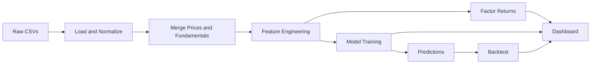

# FactorLens

FactorLens is a factor discovery and portfolio analytics pipeline that learns return-predicting signals from price and fundamentals data, then visualizes factor behavior, model diagnostics, and backtests in a Streamlit dashboard.

## Key features

- Factor construction with long-short returns and cumulative performance plots.
- Model comparison for LASSO, Random Forest, and XGBoost (metrics and backtest overlays).
- Factor correlation heatmap to reveal signal relationships.
- Portfolio builder for exposure analysis using selected tickers or custom weights.
- Regime monitoring using rolling market return and volatility.

## Project title and overview

- **Title:** FactorLens
- **Overview:** A production-ready demo for learning equity factors with supervised ML, constructing long-short factor returns, and explaining portfolio exposure from the same feature set.

## Problem statement

Traditional factor models rely on fixed, theory-driven signals that may not adapt to shifting market regimes. The goal is to learn factor signals directly from data, quantify their predictive power, and make the results explainable for portfolio decision-making.

## Solution approach

1. Normalize and align price and fundamental data.
2. Engineer factor characteristics (momentum, volatility, size, value, profitability, growth).
3. Build long-short factor returns as a time-series of signal performance.
4. Train ML models to predict forward returns and extract feature importance.
5. Compare models, factor correlations, and backtest results in the dashboard.
6. Compute portfolio exposure from selected tickers or custom weights.
7. Monitor market regime using rolling mean and volatility.

## System architecture



## Data pipeline explanation

- Ingestion and normalization: [src/data_pipeline/load_data.py](src/data_pipeline/load_data.py) standardizes column names and aligns common fields.
- Return computation and merging: [src/data_pipeline/preprocess.py](src/data_pipeline/preprocess.py) computes returns and merges fundamentals using an as-of join by date.
- Processed outputs: [data/processed](data/processed) stores `stock_features.csv` and `factor_returns.csv` for demo-mode runs.

## Feature engineering details

Features are defined in [src/feature_engineering/factor_features.py](src/feature_engineering/factor_features.py):

- **Momentum:** 12-month, 6-month, and 3-month trailing returns.
- **Volatility:** 3-month and 1-month rolling standard deviations.
- **Size:** log market cap (or inferred from price and shares outstanding).
- **Value:** book-to-market proxy from book value and market cap.
- **Profitability:** net income scaled by total assets.
- **Growth:** year-over-year revenue growth.
- **Quality:** net income to revenue margin.
- **Earnings yield:** inverse of PE ratio (when available).
- **Leverage:** total assets relative to market cap.
- **Liquidity:** 21-day rolling average volume (log-scaled).

## Factor construction methodology

Factor returns are built using quintile sorting in [src/factor_engine/factor_portfolio.py](src/factor_engine/factor_portfolio.py):

- For each date, stocks are ranked by a given feature.
- The top and bottom quantiles form long and short legs.
- The long-short spread is the daily factor return series.

## Machine learning models used

Models are orchestrated in [src/models/train.py](src/models/train.py) and include:

- LASSO regression for sparse signal selection.
- Random Forest for non-linear interactions.
- XGBoost for boosted tree ensembles.

## Financial interpretation of results

- **Factor returns** indicate whether a signal delivers positive long-short performance over time.
- **Feature importance** reveals which characteristics are driving the model’s return predictions.
- **Backtest curve** validates if the learned signal stack produces a stable return profile.
- **Correlation heatmap** shows where signals overlap or diversify.
- **Portfolio exposure** quantifies which factors dominate a user-selected basket.

## Tech stack

- Python 3.10
- Streamlit for UI: [app.py](app.py)
- pandas, numpy, scikit-learn, xgboost, plotly

## Folder structure with explanation

- [app.py](app.py): Streamlit dashboard and pipeline runner.
- [src](src): Core pipeline modules (data, features, modeling, visualization).
- [notebooks](notebooks): Research notebook walkthrough, including [notebooks/FactorLens_Build.ipynb](notebooks/FactorLens_Build.ipynb).
- [data](data): Raw inputs and processed demo outputs.

## Installation instructions

1. Create and activate a virtual environment.
2. Install dependencies:

```bash
pip install -r requirements.txt
```

## Running the pipeline

Option A (recommended demo flow):

1. Launch the app and select **Processed CSV only**.
2. Click **Run pipeline** in the sidebar.
3. Review tabs for model comparison, factor correlations, and portfolio exposure.

Option B (full Kaggle pipeline):

1. Download datasets and place them under [data/raw/prices](data/raw/prices) and [data/raw/fundamentals](data/raw/fundamentals).
2. Launch the app with **Kaggle CSVs** selected to generate processed outputs.

Option C (notebook build):

- Run the full walkthrough in [notebooks/FactorLens_Build.ipynb](notebooks/FactorLens_Build.ipynb).

## Running the Streamlit app

```bash
streamlit run app.py
```

## Deployment

Easiest options:

1. **Streamlit Community Cloud**: Connect your repo and set the entrypoint to [app.py](app.py).
2. **Hugging Face Spaces**: The front matter is ready; push the repo as a Streamlit Space.

Notes:

- Kaggle tokens are not available on hosted platforms by default.
- For demo deployments, commit processed files in [data/processed](data/processed).
