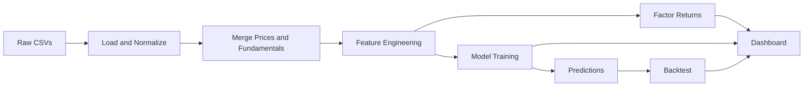

# FactorLens Technical Documentation

This document explains the complete FactorLens system end to end, including architecture, data flow, module responsibilities, and implementation details for every major component.

## 1. Project Architecture

FactorLens is a pipeline-first system with a Streamlit presentation layer. It follows a linear research workflow and then surfaces artifacts in a dashboard.

- Data ingestion and normalization from raw CSVs.
- Feature engineering and factor construction.
- Supervised model training and prediction.
- Backtesting and exposure analytics.
- Visualization and reporting in the dashboard.

## 2. Data Flow Diagram

## 3. Module Responsibilities

- [src/config.py](src/config.py): Central paths and data locations.
- [src/data_pipeline/load_data.py](src/data_pipeline/load_data.py): CSV discovery, column normalization, and schema alignment.
- [src/data_pipeline/preprocess.py](src/data_pipeline/preprocess.py): Return computation and as-of merge.
- [src/feature_engineering/factor_features.py](src/feature_engineering/factor_features.py): Feature construction and availability checks.
- [src/factor_engine/factor_portfolio.py](src/factor_engine/factor_portfolio.py): Long-short factor returns and prediction-based strategy.
- [src/factor_engine/exposure_analysis.py](src/factor_engine/exposure_analysis.py): Portfolio exposure computation.
- [src/models/train.py](src/models/train.py): Model training, metrics, and prediction outputs.
- [src/models/lasso_model.py](src/models/lasso_model.py): LASSO model definition.
- [src/models/random_forest.py](src/models/random_forest.py): Random Forest model definition.
- [src/models/xgboost_model.py](src/models/xgboost_model.py): XGBoost model definition.
- [src/utils/columns.py](src/utils/columns.py): Column normalization and matching helpers.
- [src/utils/io.py](src/utils/io.py): CSV listing and loading.
- [src/visualization/dashboard.py](src/visualization/dashboard.py): Plotly figures for factor returns, importance, correlation, and model comparison.
- [app.py](app.py): Streamlit UI and orchestration.
- [notebooks/FactorLens_Build.ipynb](notebooks/FactorLens_Build.ipynb): Notebook walkthrough of the full pipeline.

## 4. Data Pipeline Design

1. Load raw CSVs from [data/raw](data/raw).
2. Normalize column names and infer missing fields.
3. Compute daily returns per ticker.
4. Merge fundamentals to prices using an as-of join.
5. Engineer factor characteristics and target returns.
6. Persist processed datasets to [data/processed](data/processed).

### 4.1 Data Sources and Expectations

- Price files must include a date and a close price. If ticker is missing, the filename is used.
- Fundamentals should include date and ticker. If date is missing, the year in the filename is used.

The canonical column mappings are defined in `PRICE_COLUMN_CANDIDATES` and `FUND_COLUMN_CANDIDATES` in [src/data_pipeline/load_data.py](src/data_pipeline/load_data.py).

## 5. Feature Engineering Implementation

Feature logic is implemented in [src/feature_engineering/factor_features.py](src/feature_engineering/factor_features.py). The pipeline constructs:

- **Momentum:** 12-month, 6-month, and 3-month trailing returns using `pct_change(252/126/63)`.
- **Volatility:** 3-month and 1-month rolling standard deviations using `rolling(63/21)`.
- **Size:** log market cap, computed from `market_cap` or inferred from `close * shares_outstanding`.
- **Value:** book-to-market using `book_value / market_cap`.
- **Profitability:** `net_income / total_assets`.
- **Growth:** year-over-year revenue change using `pct_change(4)`.
- **Quality:** net income to revenue margin when revenue is available.
- **Earnings yield:** inverse of `pe_ratio` when available.
- **Leverage:** `total_assets / market_cap`.
- **Liquidity:** 21-day rolling average volume (log scaled).
- **Target:** forward return `return_next` via `shift(-1)` per ticker.

Rows without valid features or target are removed to keep model training stable and avoid leakage.

## 6. Factor Portfolio Construction

In [src/factor_engine/factor_portfolio.py](src/factor_engine/factor_portfolio.py), each feature is converted into a long-short factor return series.

- For each date, the cross section is sorted by the feature.
- The top and bottom quantiles are averaged to form long and short legs.
- The spread between long and short legs is the factor return.

This produces a factor return time-series for each feature, used in diagnostics and correlation analysis.

## 7. Machine Learning Model Training

Training is centralized in [src/models/train.py](src/models/train.py). The function `train_models()`:

- Splits train and test data in chronological order (no shuffle).
- Scales features for linear models using `StandardScaler`.
- Trains a model based on `model_choice`.
- Returns metrics (MSE, R2), prediction DataFrame, and feature importance.

### 7.1 Model Implementations

- LASSO uses `LassoCV` with cross-validation for sparse factor selection.
- Random Forest uses a fixed-depth ensemble for non-linear interactions.
- XGBoost uses gradient boosting with subsampling for generalization.

## 8. Backtesting Methodology

The strategy backtest in [src/factor_engine/factor_portfolio.py](src/factor_engine/factor_portfolio.py) uses the model predictions to form a long-short portfolio:

1. Sort tickers by predicted return each date.
2. Take equal-weight long positions in the top quantile.
3. Take equal-weight short positions in the bottom quantile.
4. Compute daily and cumulative long-short returns.

The Streamlit dashboard also plots a multi-model comparison using the same long-short logic.

## 9. Portfolio Exposure Analysis

[src/factor_engine/exposure_analysis.py](src/factor_engine/exposure_analysis.py) computes factor exposure for a user-provided portfolio:

- Uses the latest available feature values per ticker.
- Multiplies each feature by the portfolio weight.
- Aggregates weights across tickers to produce factor exposure.

The dashboard supports two modes:

- Equal weights based on selected tickers.
- Custom weights entered as ticker,weight pairs.

## 10. Visualization Layer

Plotly charts are defined in [src/visualization/dashboard.py](src/visualization/dashboard.py) and displayed in [app.py](app.py).

Available charts:

- Cumulative factor returns line chart.
- Feature importance bar chart.
- Factor correlation heatmap.
- Model comparison bar chart for MSE and R2.
- Model comparison backtest overlay.

## 11. Performance Metrics

- **Model metrics:** MSE and R2 on the test split.
- **Strategy metrics:** cumulative return, and annualized Sharpe proxy from daily long-short returns.

## 12. Configuration System

Paths for data inputs and outputs are defined in [src/config.py](src/config.py). This centralizes directory locations for raw data, processed outputs, and the Streamlit app.

## 13. File Structure

- [app.py](app.py): Streamlit entrypoint.
- [src](src): Core library code.
- [data/raw](data/raw): Raw CSV inputs.
- [data/processed](data/processed): Processed outputs for demo mode.
- [notebooks](notebooks): Build and research notebook.
- [.streamlit/config.toml](.streamlit/config.toml): Theme and server defaults.

## 14. Scalability Considerations

- Chunked loading can be added for large CSVs.
- Feature generation can be parallelized by ticker or time slice.
- Model training can be extended with time-series cross-validation.
- Caching processed data avoids repeated feature engineering.

## 15. Error Handling

- Input validation detects missing files and missing required columns.
- User-facing errors in [app.py](app.py) provide recovery hints.

## 16. Data Validation

- Column normalization enforces consistent names across datasets.
- Missing values and infinite values are cleaned before model training.
- The pipeline removes rows without valid `return_next` targets.

## 17. Deployment Strategy

- Streamlit Community Cloud: connect repo and set entrypoint to [app.py](app.py).
- Hugging Face Spaces: front matter in [README.md](README.md) supports Streamlit Spaces.
- Use processed CSVs in [data/processed](data/processed) for demo builds.

## 18. Security Considerations

- Avoid committing Kaggle tokens to the repository.
- Store secrets via platform-specific secret managers for hosted deployments.

## 19. Performance Optimization

- Cache intermediate steps in the Streamlit app for larger datasets.
- Precompute processed datasets to minimize repeated feature engineering.
- Downsample or filter tickers for faster prototyping.

## 20. UI Workflow

The Streamlit dashboard in [app.py](app.py) is organized into tabs:

- Overview: snapshots of data and factor returns.
- Factors: factor return history and correlation heatmap.
- Model: metrics, comparison charts, and feature importance.
- Backtest: cumulative return and return series.
- Exposure: portfolio builder and factor exposures.

## 21. Regime Monitoring

The regime monitor in [app.py](app.py) derives a simple market proxy from the cross-sectional mean of returns:

- Computes a daily market return by averaging ticker returns per date.
- Calculates rolling mean and rolling volatility over a 63-day window.
- Labels regimes using median thresholds for mean and volatility:
    - **Risk-on:** high mean, low volatility.
    - **Risk-off:** low mean, high volatility.
    - **Mixed:** all other cases.

The latest regime and rolling statistics are surfaced in the Overview tab.

## 22. Notebook Workflow

The notebook in [notebooks/FactorLens_Build.ipynb](notebooks/FactorLens_Build.ipynb) mirrors the pipeline in a step-by-step format:

- Folder initialization and Kaggle download.
- Data loading and return computation.
- Feature engineering and factor returns.
- Model training and importance output.
- Portfolio exposure and visualization.
- Persisting processed outputs for the app.

## 23. Known Limitations

- Factors are simple cross-sectional signals; no transaction costs are included.
- Split is time-ordered but not walk-forward validation.
- Data quality depends on the raw CSV source.

## 24. Extension Points

- Add new factor features or alternative horizons in [src/feature_engineering/factor_features.py](src/feature_engineering/factor_features.py).
- Add new models in [src/models](src/models) and integrate them in [src/models/train.py](src/models/train.py).
- Add new charts in [src/visualization/dashboard.py](src/visualization/dashboard.py).
- Add additional backtest metrics in [src/factor_engine/factor_portfolio.py](src/factor_engine/factor_portfolio.py).
